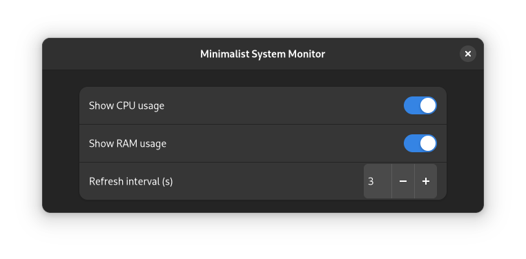
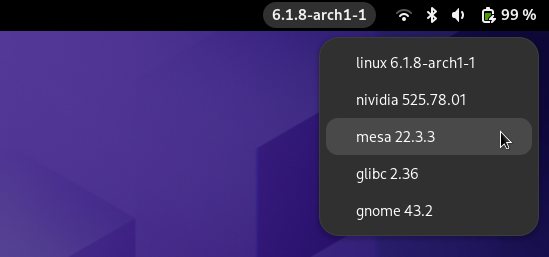

Extensions for [GNOME Shell](https://gitlab.gnome.org/GNOME/gnome-shell).


# Minimalist System Monitor

System monitor that displays CPU and/or RAM usage.

[](https://www.gnu.org/licenses/old-licenses/gpl-2.0.en.html)




Inspired and adapted from [ssm-gnome@lgiki.net](https://extensions.gnome.org/extension/4506/simple-system-monitor/).


# Version Indicator Panel Button

Display the versions of key system software. Useful when on a rolling release.

[](https://www.gnu.org/licenses/old-licenses/gpl-2.0.en.html)



**Features:**
- Current kernel version in the top bar.
- Pop up menu displays version of (if installed): nvidia driver, mesa, glibc, and gnome shell.
- When the linux entry is clicked, current kernel parameters are copied to the clipoard.

**Limitation:** the versions of mesa and glibc are only displayed on distributions using `pacman`.

Inspired and adapted from [kernel-indicator@elboulangero.gitlab.com](https://extensions.gnome.org/extension/2512/kernel-indicator/).


# Hide clock and date

Hide top panel clock and calendar date by making them transparent.

[](https://www.gnu.org/licenses/old-licenses/gpl-2.0.en.html)


# Installation

For each extension, the supported versions of GNOME Shell are in `metadata.json`.

## From this repository

Compile the GSettings schema file (if any) and copy the desired extension folder to your system:


```bash
$ git clone https://github.com/fmonteghetti/gnome-shell-extensions && cd gnome-shell-extensions
$ glib-compile-schemas DESIRED-EXTENSION/schemas/
$ cp -r DESIRED-EXTENSION ~/.local/share/gnome-shell/extensions
```

The extension will show up once GNOME Shell is restarted: `Alt+F2 r` on X11, log in and log out on Wayland.

## From extensions.gnome.org

The extensions will eventually be available at [extensions.gnome.org](https://extensions.gnome.org).

# Development guidelines

GNOME Shell extensions are written in a dialect of Javascript called GJS and run within the main loop of GNOME Shell. To avoid blocking the main loop, the extensions in this repository use Javascript `Promise` for asynchronous access to ressources.

Useful links to get started:

- [Official development guide](https://gjs.guide/extensions/)
- [API documentation](https://gjs-docs.gnome.org/)
- [GNOME Shell library](https://gitlab.gnome.org/GNOME/gnome-shell/-/tree/main/js). These functions can be used in GNOME Shell extensions.